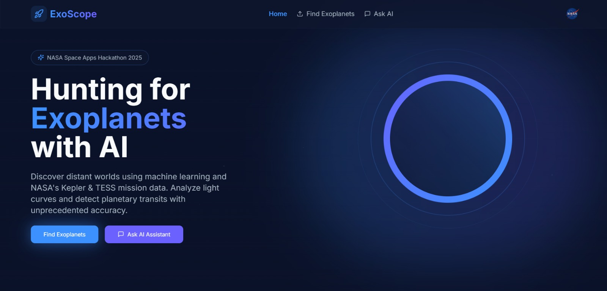
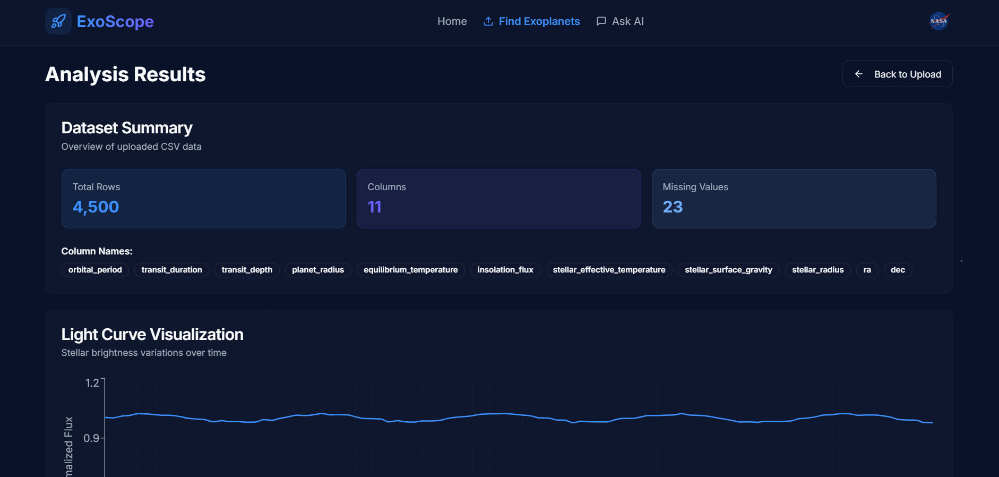
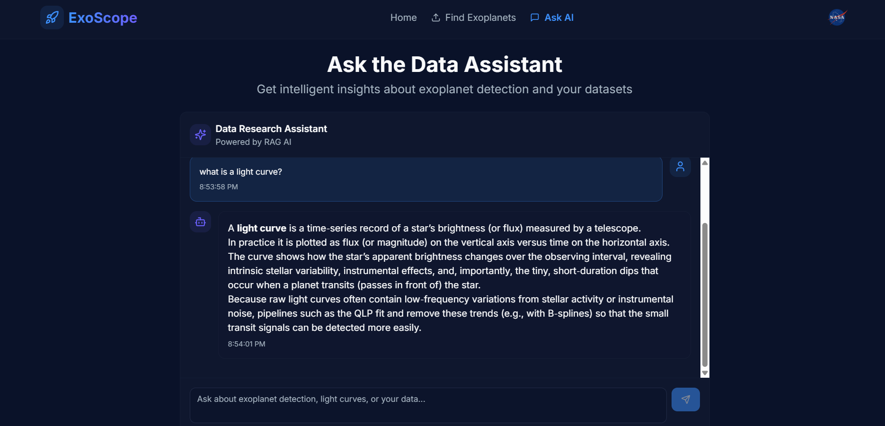

# Exoscope - A World Away: Hunting for Exoplanets with AI

🌌 **NASA Space Apps Global Hackathon Project**

> 🔭 Explore the cosmos with AI — detect exoplanets straight from your browser!

---


<p align="center">
   
</p>
<p align="center">
   
</p>
<p align="center">
   
</p>


---

## 🚀 Project Overview

Exoscope leverages machine learning to identify candidate exoplanets based on light curve data. The platform includes:

- **Dataset Upload & Analysis**: Upload CSV files and visualize stellar brightness variations
- **AI Detection Model**: Trained ML model identifies exoplanet candidates automatically
- **Research Assistant**: RAG-powered chatbot helps researchers understand and explore data

## 🛠️ Technology Stack

### Frontend
- **React 18** + **Vite** - Fast, modern development
- **TypeScript** - Type-safe code
- **Tailwind CSS** - Space-themed UI design
- **shadcn/ui** - Beautiful component library
- **Recharts** - Light curve visualization
- **React Router** - Navigation


### Backend
💫 The FastAPI backend is available here:  
👉 **[Exoscope Backend Repository](https://github.com/JosephJonathanFernandes/Nasa-Space-Hackathon-WizCoders-backend)**

## 📁 Project Structure

```
src/
├── components/
│   ├── layout/
│   │   ├── Navbar.tsx          # Navigation bar
│   │   └── Footer.tsx          # Footer with credits
│   ├── home/
│   │   ├── Hero.tsx            # Hero section with 3D planet
│   │   └── Features.tsx        # Feature highlights
│   ├── upload/
│   │   ├── UploadSection.tsx   # CSV upload with drag-drop
│   │   ├── AnalysisResult.tsx  # Results display
│   │   └── LightCurveChart.tsx # Light curve visualization
│   └── chat/
│       ├── ChatInterface.tsx   # Chat UI
│       ├── MessageBubble.tsx   # Message display
│       └── ChatInput.tsx       # Message input
├── pages/
│   ├── Home.tsx               # Landing page
│   ├── UploadPage.tsx         # Upload & analysis page
│   ├── ChatPage.tsx           # AI chatbot page
│   └── NotFound.tsx           # 404 page
├── services/
│   └── api.ts                 # Backend API integration
├── hooks/
│   ├── useUpload.ts           # Upload logic hook
│   └── useChat.ts             # Chat logic hook
└── App.tsx                    # Main app with routing
```

## 🚦 Getting Started

### Prerequisites
- Node.js 18+ and npm

### Installation

```bash
# Clone the repository
git clone <YOUR_GIT_URL>
cd <YOUR_PROJECT_NAME>

# Install dependencies
npm install

# Start development server
npm run dev
```

Visit `http://localhost:8080` to see the application.

## 🧠 AI Model Integration

The platform is designed to work with ML models trained on:
- NASA Kepler mission data
- TESS mission observations
- Transit detection algorithms
- RAG (Retrieval-Augmented Generation) for chat

## 📝 Development Guidelines

- **Components**: Functional components with TypeScript
- **Styling**: Design system tokens (no hardcoded colors)
- **State**: React hooks for local state, React Query for server state
- **Documentation**: JSDoc comments on all components/functions
- **Accessibility**: ARIA labels, keyboard navigation

## 🌟 Features

### Current
✅ Dataset upload with drag-and-drop  
✅ Light curve visualization  
✅ Candidate detection display  
✅ AI chatbot interface  
✅ Responsive design  
✅ Space-themed animations  

### Coming Soon
- [ ] Advanced filtering and sorting
- [ ] Export analysis reports
- [ ] User authentication
- [ ] Dataset history

---

## Table of contents

- Quick start
- Development
- Repository separation
- Contributing
- Code of Conduct
- Security
- License
- Credits

## Quick start

This repository contains the frontend application for Exoscope. The frontend and backend are maintained as separate repositories — see the "Repository separation" section below for links.

Prerequisites
- Node.js 18+ and npm (or pnpm/yarn)

Local development

1. Clone the frontend repository (or navigate into this folder if already cloned).

   git clone <YOUR_FRONTEND_REPO_URL>
   cd <your-frontend-directory>

2. Install dependencies

   npm ci

3. Start the development server

   npm run dev

The Vite dev server will start and print the local URL (commonly http://localhost:5173). If you see a different port in your terminal, open that instead. Note: the instructions earlier in this file still reference `http://localhost:8080` — keep whichever address your dev server reports.

Build and preview

   npm run build
   npm run preview

## Development

- Use TypeScript and React functional components.
- Follow the existing project structure in `src/` for pages, components, hooks and services.
- Keep UI tokens in Tailwind and avoid hardcoded colors.

## Repository separation

Important: The frontend and backend are separate repositories. This repository contains only the frontend application and documentation. The backend (FastAPI) repository used by this project is available at:

https://github.com/JosephJonathanFernandes/Nasa-Space-Hackathon-WizCoders-backend

If you are running the full stack locally, clone and run the backend repo separately and update the frontend `src/services/api.ts` (or environment variables) to point to your local backend URL.

## Contributing

Thanks for wanting to contribute! Please read the project's `CONTRIBUTING.md` for contribution guidelines, testing, and branching rules. A short summary:

- Fork and create feature branches from `main`.
- Open concise pull requests with a clear description and changelog when appropriate.
- Add or update tests for new behavior.

## Code of conduct

Please follow the project's `CODE_OF_CONDUCT.md`. We expect contributors to be respectful, inclusive, and collaborative.

## Security

If you discover a security vulnerability, please report it privately to the maintainers via the contact method listed in `SECURITY.md` rather than opening a public issue.

## License

This frontend repository is distributed under the MIT License — see the `LICENSE` file for details.

## Credits

This project was developed for the NASA Space Apps Global Hackathon. Thanks to the participants, mentors, and the open-source ecosystem.

---

**Built with ❤️ for exploring the cosmos** 🪐
